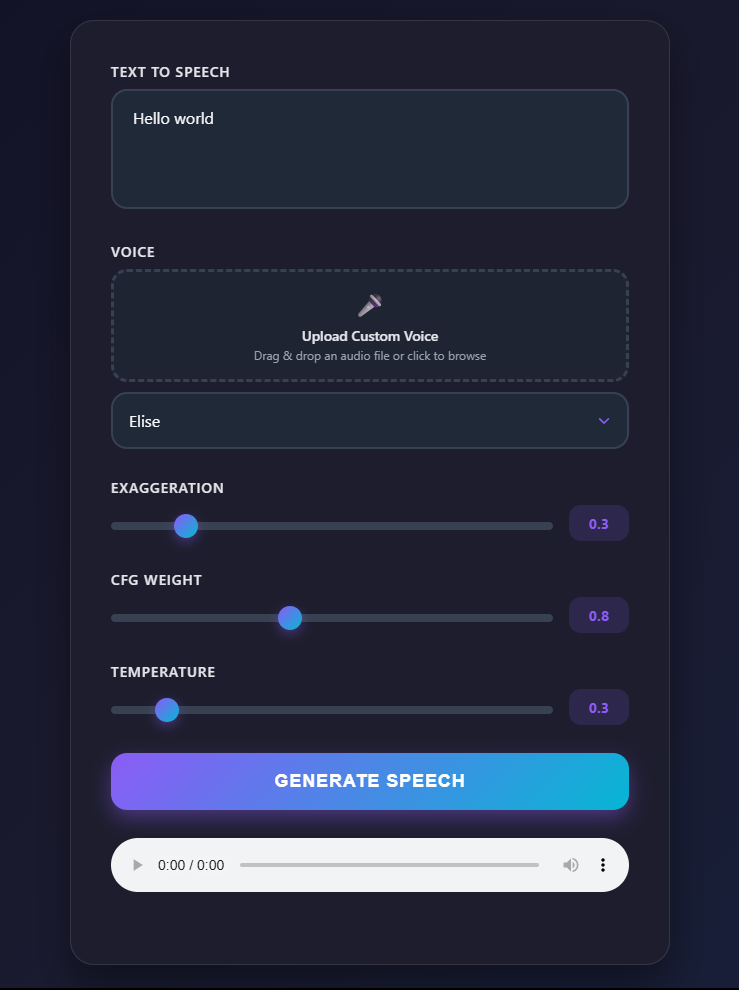

OpenAI API compatible TTS model hosted on localhost:5000

### Features 
- Nice GUI
- Custom Voices / Voice Cloning (from only seconds of audio)
- Lazy loading / Auto Unload (5m)

### How To Run
- clone the repo
- download all model files from https://huggingface.co/ResembleAI/chatterbox/
- place them in `chatterbox/` folder (conds.pt, s3gen.pt, t3_cfg.pt, tokenizer.json, ve.pt)
- run `python server.py`
- go to localhost:5000

### Adding voices
- place your voice in `voices/` folder
- rerun server.py and refresh the page
- select your voice in the dropdown menu

### Using in Open WebUI
- `admin panel > settings > audio`
- `TTS engine: OpenAI`
- `API Base URL: http://localhost:5000/v1`
- `API Key: unused (0)`
- `TTS Voice: elise`
- `TTS Model: unused (chatterbox)`
- Save